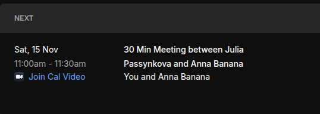
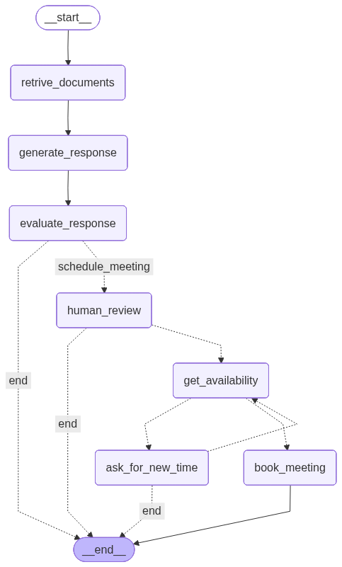

# Digital Clone Agent

A LangGraph-based agent system that provides automated responses to educational questions with quality evaluation and human-in-the-loop meeting scheduling capabilities.


## Result with booking

<pre>
Question: My son struggles with tennis shots, what should I do?

Action: schedule_meeting
Please provide your decision:
The agent can't answer the question. We need to schedule a meeting with teacher. Please approve this meeting. (yes/no): yes
Enter user name: Anna Banana
Enter email: anna@banana.com
Enter meeting time (format: 1 Dec 2025 20:00PM): 15 Nov 2025 11:00AM
Checking availability for 2025-11-15T11:00:00
Booking meeting for 2025-11-15T11:00:00 with Anna Banana at anna@banana.com

Question: My son struggles with tennis shots, what should I do?
Booking Details: Meeting booked for 2025-11-15T11:00:00 with Anna Banana at anna@banana.com
Teacher will address your question in the meeting.
</pre>



## Architecture

The agent implements a state machine workflow using LangGraph, processing user questions through document retrieval, response generation, evaluation, and conditional meeting scheduling.



## Workflow

The agent follows a sequential pipeline with conditional branching:

1. **Document Retrieval** (`retrive_documents`): Queries a Qdrant vector store for relevant context using semantic similarity search. Initializes the collection with FireCrawl-loaded documents if it doesn't exist.

2. **Response Generation** (`generate_response`): Uses GPT-4o-mini to generate responses based on retrieved documents and a style profile. Enforces domain-specific constraints (5th grade math only).

3. **Response Evaluation** (`evaluate_response`): Scores responses using three metrics:
   - StyleScore (40%): Communication style adherence
   - Groundedness (40%): Context-based grounding
   - Confidence (20%): Response clarity and directness

4. **Conditional Routing**: If score < 0.5, routes to meeting scheduling workflow; otherwise terminates.

5. **Meeting Scheduling** (conditional path):
   - `human_review`: Interrupts workflow for human approval
   - `get_availability`: Checks teacher availability (simulated)
   - `ask_for_new_time`: Requests alternative time if unavailable
   - `book_meeting`: Finalizes meeting booking

## State Schema

```python
class DigitalCloneState(TypedDict):
    user_name: str
    email: str
    documents: list[str]
    meeting_time: str
    score: float
    availability: bool
    booking_details: str
    question: str
    response: str
```

## Key Components

- **Vector Store**: Qdrant with OpenAI embeddings (text-embedding-3-large)
- **LLM**: OpenAI GPT-4o-mini for generation and structured evaluation
- **Document Loader**: FireCrawl for web content extraction
- **Text Processing**: RecursiveCharacterTextSplitter with 1000 char chunks, 200 char overlap
- **Checkpointing**: MemorySaver for state persistence and interrupt handling

## Dependencies

- langchain-core
- langchain-openai
- langchain-community
- langgraph
- qdrant-client
- langchain-qdrant
- firecrawl-py

## Environment Variables

- `FIRECRAWL_API_KEY`: Required for web document crawling
- `OPENAI_API_KEY`: Required for LLM and embeddings

## Usage

The agent processes questions through the workflow graph, automatically handling interrupts for human review when response quality is insufficient or meeting scheduling is required. The graph visualization is generated on execution and saved to `digital_clone_visualization.png`.


